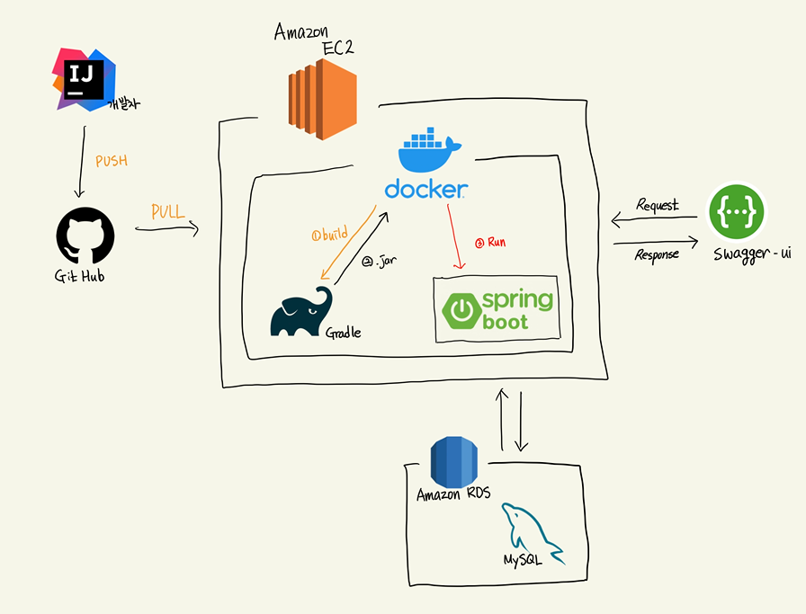

# Chal-Chal-Server
> 찰찰 서버

아키텍쳐
-------------

- Swagger : [Swagger-ui](https://chalchal.app/swagger-ui/)

기획 설계
-------------
- ERD : [ERD CLOUD](https://www.erdcloud.com/d/s7cTuEjDARQJz2dH9)
- 화면 기획 : [Adobe XD](https://xd.adobe.com/view/cd432a5b-9f97-4d58-8e9c-9f31ce9a6dad-9810/)
- 흐름도 : [Diagrams.net](https://viewer.diagrams.net/index.html?target=blank&highlight=0000ff&edit=_blank&nav=1&title=chalchal-flow.png#R7V1bl5u2Fv41rD5NFiCuj2DPpKcnTU%2BanpPmkbEZmwabKWYu7q8%2FEkjYSMJcjMDGZGUlIITA2nt%2F%2Byohgdnm%2FWPsPa9%2FjZZ%2BKKny8l0Cc0lVFdNS4H%2BoZZ%2B16KqWNaziYIk7HRq%2BBv%2F4uFHGrS%2FB0t8VOiZRFCbBc7FxEW23%2FiIptHlxHL0Vuz1FYfGpz97KZxq%2BLryQbf0WLJN11mqp5qH9Zz9YrcmTFcPOrmw80hn%2Fkt3aW0ZvR03gXgKzOIqS7GjzPvNDNHlkXr79a%2F8t%2FPTD%2BPjLl93f3n%2Fdf%2F%2Fx%2BX932WAPTW7Jf0Lsb5PWQwPv8fcv7hczSD47rxs1kX9bf7ozMTFfvfAFTxj%2BscmezGAcvWyXPhpFloD7tg4S%2F%2Buzt0BX3yDPwLZ1sgnhmQIPd0kc%2FfBnURjF6d0AKBrQNXjlKQjDo3ZDMw3LxO2%2FwfGCBHGYhp7xFG2To65P6R%2FYXnMe8Hy9%2BnHivx9xAZ6Xj3608ZN4D7vgq3cKoTFmck3D528HllFN3LY%2BYhfVwI0eZtNVPviBFPAAU6MBZXSrY8oU5xnILEmerIW%2FWDBE3EZbX%2BTkm2b15APAmXzFEjb5xq1OviKzk2%2FxJh9owibf7n%2Fyn3yDM%2FnwytK0H2VZJAVydj%2FF%2Fmqv7K%2BwBLifS7YjWTPpfibZrmTL0r0jubIE3wG13EuWLoEHlk7raPP4squhN4hyJfj%2F4G2CEE3Jz3746ifBwsMXsImhwDl1vTBYbeHJAhLFj3P6EUWfDowIv13BM%2BNw9kcEHz%2B%2F04RKlkxJls7SNZe2Y7oKI6vKkPVzxFDMX0LzCZ9GcbKOVtHWC%2B8PrW5R9o5o%2BJefJHtMHu8liWDTYYRPUTrnCkVFdO5vlw6y9OD5YxgtfmRNDwH6dekz4Bnub%2FFpfMw8offoh663%2BLFKX%2FQsIEWTcZLYOWpm%2FWM%2F9JLgtWh68uiIR%2FpPFMDXOHSJnp52flI040gfwlcGzVeW%2FUEvPmkXvcQLH994aixdrxwr8eKVnzBjpQyYT0R7ngTtoKZcHyg19AGFIqvQ2%2B0w91QwlzC0YChhctCCpwWEqWGOZ4Cmfy65mnTvSo4t2RppgU%2BQUSOkkp3SzTIkB%2F5iI4Rv6T7G8GiFjtJLmuQqKUmB5E5Ko8gGwLo0pdHYEr4yhVCt7yCN4%2F2f%2BZPhyXd0AoESn87fjy%2FO962wIsPZanmsVEltdVBujwKKBW2KtWprF3okBqsE6xZzsndGYO%2BoNCSeYe%2BoNG%2F3bu9wojoVWjU1eZzZwfZB3WTJmVRnUXUytB1cdbJxjO%2F%2BbgKgawMgpRo0agNQNZYJxh8ycZ0A0Oi8MJo8gzthyhSzgUO9B8mfB5Mbnn0nD4HHB%2BsbnbQzvjP5rVbblfBEGEn%2BYAMACsx01ydmAbVEGTY34ulwE%2B0OlAAW5A5vf9TtGXXYcX5WDrO08AG54ZsVb4AH2Tt0i59sWOQGlfrBJT54wblM9ucSK%2FrlWg2Adn5BWwmkHSBmJNEmg97GZIDHFjpwDHTMjQS68%2FRGV7IBChsebkxtDRcOa00%2BzsnwoMozUHr1cRROfBDxhJIGgh3JNTEfZAwxkfNUivACyMnGJ25ZvSnNIr65oXpspuZGay%2BGKgHrat1pXLDupKxXxr%2BqrTuZkWjJEaw7VdbdvkF56trsq8u6mAvkD7KqaUVfoc%2BEPZXaVVW7JTfTqX9mJNHczBYG3WA0osT3USqUQ8dC0DwiYVmW0akQ7Lk3tMnpALm7nA5nLNFiwRax3LJYNLOZutYNl2vV0Nb%2BOUxv0vE9UVE5k5YupSIqR99A3kxoVE5lQxQ3aGb1E5VroHF0RVWLzKD0anYR8SK82zoITptwmipI3OgHAbNC3CpuECRutYM%2BOir3y%2Bo4LcDI49XnC02F4gubE8DpNWGo1lg2NMFgH5YI8c2uCC%2BLvGy2RUutaiRRaEkeXF7vTsur3gdactYz3c8RHlpWemCiRMrosFGnl%2FUNjo2AX9JuqaS6xUG5LHRgpi2u5Bpo1YEq%2F%2FT5JylLT0GS2VleS0babfRU0wcvgQGc9OOk0WppNH7hjNJnPoKAX6W6JMJ5NeqSXrYpt1WXOhUX0Grm9xurS1r76UZDdUndIEZdAp5zMU9XFMnpgYKWGWE0htA9J2g8Gx8a0%2F7FBaAxu6jiZtH4%2BrLDBGSr0bhhim1oNNZNpSgodICmPhrTI9E7fDRG486XzE4u%2FhTpPOUG661LDdmYqS7Qd6cfVeW9V94iyCCpsR%2FJ2OVNuCPRedHH0ELJmG6tNRI9EhCVfDA1%2FiuXvxl1Q3W2gs7795GtIC9Z7VDkGxg4KH9h2YyYj86hAIMH5TTOZkMTunaMrpWOASHvtaArE%2FmnrfT2qd2zKym6tvc13vqLOYo%2BOyQOcrzywknhLN9EZ3QQRu8qMXxeQauxR8rYIewycq5a3QVhFwJjZfnIFoXudDhalN8G6LReHy6Yxok6lkJgup4MbTGVVaTMxw%2BBvLAwb7dacQjI29akXEWNPYkK6IDM4PThlyCU0mfkaRW1RpK7V%2FoQfpksiGvMcWt119wRNXYt5gmt6%2FXW5gm9SEMXVa9e9srlv9EeIKSsT0GPS%2FEYmq%2BjGolIgrLags5FUhlCwtRJwi5Ewq6sDppeMn6G0qPzKWeXEpRq1yEkjLd1N3QZAN6%2FBfsON%2BGQq2VB5MFikjqn1nnCvxsuEimL251vy5%2BfMan7oF5gbSo3b1Oo2LYospmwVbriRCmNLlOQC9nZq7OAUTFSZ3Y%2FVdeuVy0dr7hBkLzzUgvs%2FnXZR0i09CMk2fa3FgML0FpIitLObD6GbIpg4YUOvrAJlssMMPxd8I%2F3mA6F5ALPLhxXdyV9jsaCaLHDiJBL%2BNGXqh4tHQFk%2BYfFhFk%2Fdb4hxgun0mWK3X2zgg2vQKRV5SX6Jwx2yYWRLv%2FIWNlnyYSRTqFgRecYrv2SbvLbL8RvN8B1acgya7G5hqRVrSj79vTqZTHqzuB57S7K%2BKE1yPIhKYuKIcFR48iripSL28nB4K9WRtviZhWqOlqkfJvUGX4dnDG5iZebsb0WlcWuZ2m9cqe%2FhTvskyqXEVfcIUjT8R07Cj8zV8%2B2eDuU326NrVWkV14jPVR9jMH%2FbBZXF469eIlShcPThldbVkIb10h3%2FCefcx0bbcwLIw152GSkTEZKd0aKoXRmpBi0jy7MSCHbtTR4N60HI8VkI5WThA4T7rqyMhUqeGSoLbcSBjTX19s7%2B9xgl1GxtliR9VP9BUkjJzg2SeMNF02UMG1jIVO1nhSfelJqKrtXfHLvdHdBMslb%2FeqQhfpkxT520a10S82ydUXDJvmAAWywlJgkn5%2F%2BEeiVUHsuaFo9r0RYis%2FkLZfNoi8I%2BQo0M%2F5%2BiciFu2x2HdhBNZ7f0xkj10nQZrb20PPxf2mEBv7NcvZGuhe1K1kP6AA%2FEf6C7KE46HNBPIMR%2BZhdWn1P54xMvsGySv7JhDM9WHgaR4h2B7CALv7612jpox7%2FBw%3D%3D)

기술 스팩
-------------
* Java 17
* Spring boot (2.7)
* Spring Data JPA
* Gradle
* Junit4
* MySQL
* Docker
* Amazon AWS EC2, RDS

도메인의 역할
-------------
### 인증 관련
> 로그인, 로그아웃 및 회원 상태에 대해 관리
  * 자체 로그인
      * ✅ ID와 PASSWORD가 동일 해야, 로그인 토큰이 발급
  * 간편(소셜) 로그인
  * 로그아웃
      * ✅ 발급된 토큰이 삭제 된다
  * 회원가입
      * ✅ DB에 저장되어 있지 않는 이메일 경우만 가능 
      * ✅ 사용자에 대한 필수 값을 입력
      * 이메일 인증 단계를 거쳐야 회원가입이 완료
  * 이메일 인증
      * ✅ 가입 이메일로 임의의 6자리 코드 만들어 이메일 발송
      * ✅ 발송된 코드 6자리가 정확해야 인증 완료
      * 잘못된 이메일일 경우, 재입력 받고 재전송
  * 비밀번호 재설정
      * 회원가입 시 입력한 이메일 입력
      * DB에 해당 이메일이 있을 경우, 비밀번호 재설정 가능한 URL이 담긴 이메일 발송
  * 회원 탈퇴
      * 사용자의 탈퇴 날짜 및 시간으로 최정 업데이트 시간 수정
      * 사용자의 USE_YN 구분값을 'N'으로 수정 
      * 탈퇴 완료 시 로그아웃

### TO DO LIST
> 할 일에 대해 관리
  * 할 일 조회 
      * 조건(날짜, 완료 여부) 등을 충족한 리스트에 한 해 select
  * ✅ 할 일 작성 
  * ✅ 할 일 수정
  * 할 일 삭제
      * ✅ DEL_YN 구분 값을 'N'으로 수정. DB에는 데이터가 남으나, 회원은 재조회 불가능
  * ✅ 목표 작성
  * ✅ 목표 수정
  * ✅ 목표 삭제

### 친구
  * 주변 친구 검색
  * ID 검색
  * 팔로우
  * 언팔로우

### User (사용자)
> 사용자를 담당
  * User의 상태
    * id (필수)
    * email (필수)
    * password (필수 min:8, max:14)
    * user_id (필수, min:6, max: 16)
  * 회원가입 기능 (유저가 생성 된다.)
    * email, user_id
    * SNS 회원 가입

### 프로필
* 프로필 사진
    * 프로필 사진 업로드
    * 프로필 사진 삭제
* 배경 사진
    * 배경 사진 업로드
    * 배경 사진 삭제
* 정보 수정
    * 필수 값이 아니면 수정이 가능
